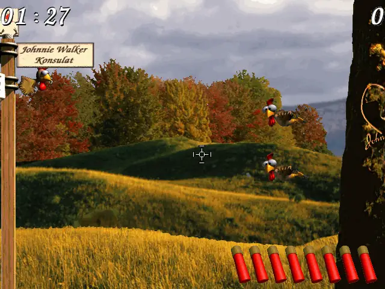

# Moorhuhn Jagd

A remake of [Moorhuhn Jagd](https://de.wikipedia.org/wiki/Die_Original_Moorhuhnjagd),
the 1999 Windows game by Witan, built with C++23 and SDL3.

Aim across the scrolling countryside, hit chickens and special targets,
and score as many points as you can in 90 seconds.



## Play

Download the ZIP for your system from **Releases → Nightly build** and extract it:

- **Linux:** run `./moorhuhn`.
- **Windows:** run `moorhuhn.exe`.
- **macOS:** open `Moorhuhn.app`. Choose `arm64` for Apple Silicon or `x86_64` for Intel.

## Controls

| Control | Action |
| --- | --- |
| Mouse | Aim; move to a screen edge to scroll |
| Left click | Shoot |
| Right click | Reload when the magazine is empty |
| Left / Right arrow | Scroll the view |
| Space | Start a round |
| Enter | Confirm a name |
| Escape | End a round; exit from the title screen |

## Build from source

Requires CMake 3.25+, Ninja, Make, Python 3, and a C++23 compiler.
On Windows, use an MSYS2 UCRT64 shell.

```sh
make run
```
